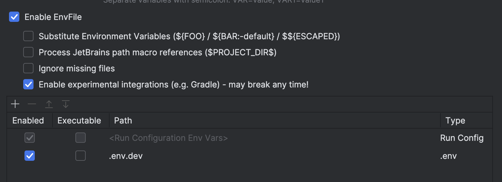

# Company finance management system
__Company finance management system__ - API для управления финансами предприятия и финансовая аналитика компании.
## Основные функции
- Управление подразделениями предприятия
- Многопользовательский и многоролевой доступ сотрудников
- Раздельный финансовый учет по каждому подразделению
- Финансовая аналитика
## Технологический стек
- Java 21
- Spring Boot 4.1.1
- Mapstruct
- Gradle 8.14.3
- PostgreSQL 18.6
## Как запустить локально
Для начала, настройте файл окружения .dev
```dotenv
# Подключение БД
DB_USER=admin
DB_PASSWORD=admin
DB_NAME=company_finance_management_system
```
Запустите docker-compose следующей командой
```shell
docker compose up
```
Или вот так, если имя файла переменных окруженя отличное от .env
```shell
docker compose --env-file <имя_env_файла> up
```
Чтобы "пробросить" .env файл в IntelliJ Idea вам будет необходимо установить плагин EnvFile из Marketplace. 
Далее добавляем .env файл: Run->Edit configurations. Включаем EnvFile и внизу нажимаем +, чтобы выбрать .env файл (при выборе файла нужно нажать Command + Shift + . (точка), чтобы отобразить скрытые файлы).

> Для запуска приложения через IntelliJ Idea из docker-compose следует поднимать только сервис "db"
> ```shell
> docker compose up <имя-сервиса> # в данном случае db
> ```
